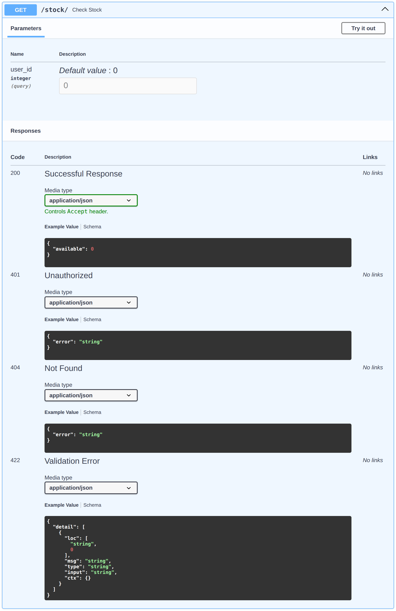

# fastapi-error-map

[](https://badge.fury.io/py/fastapi-error-map)

[](https://codecov.io/gh/ivan-borovets/fastapi-error-map)

[](https://github.com/ivan-borovets/fastapi-error-map/actions)

Elegant per-endpoint error handling for FastAPI that keeps OpenAPI in sync.

Declare **on the route** how exceptions become HTTP responses, and the OpenAPI error schema is generated
from that same declaration. Error handling and schema can't drift — they are one source.

## Install

```bash
pip install fastapi-error-map
```

Requires Python 3.10+ and FastAPI 0.100+.

## Quickstart

Two steps:

1. Swap `APIRouter` for `ErrorAwareRouter`.
2. Declare `error_map` on the route.

```python
from fastapi import FastAPI
from pydantic import BaseModel

from fastapi_error_map import ErrorAwareRouter, rule


class AuthenticationError(Exception): ...


class UserNotFoundError(Exception): ...


class Stock(BaseModel):
    available: int


def notify(err: Exception) -> None:
    print(f"lookup failed: {err}")


router = ErrorAwareRouter()


@router.get(
    "/stock/",
    error_map={
        # Short form: map exception to status.
        AuthenticationError: 401,
        # Full form: rule() adds side effect (and headers, OpenAPI docs, ...).
        UserNotFoundError: rule(404, on_error=notify),
    },
)
def check_stock(user_id: int = 0) -> Stock:
    if user_id == 0:
        raise AuthenticationError("authentication required")
    raise UserNotFoundError(f"user {user_id} not found")


app = FastAPI()
app.include_router(router)
```

The handler raises. The router maps each exception to its status and body:

- `GET /stock/` → `401 {"error": "authentication required"}`
- `GET /stock/?user_id=1` → `404 {"error": "user 1 not found"}`

The same map drives OpenAPI schema — `401` and `404` appear under the route, no `responses=` to
maintain by hand:

<div align="center">
  
  <p><em>Figure 1: error responses generated from the map.</em></p>
</div>

Full runnable file: [`examples/readme_quickstart.py`](examples/readme_quickstart.py). For the bare
minimum — one exception, one status — see [`examples/quickstart.py`](examples/quickstart.py).

## Why not global handlers?

To turn application errors into HTTP responses, FastAPI lets you attach a global handler:

```python
app.add_exception_handler(UserNotFoundError, handle_user_not_found)
```

It works at runtime, and quietly costs you two things.

First, you cannot see it at the route. The handler lives elsewhere, so the route never shows which
errors it returns — and neither does OpenAPI: the schema lists `200` and `422`, never the `404` you
actually send. Your Swagger is wrong the moment you add a handler.

Second, one type maps to one response — for every route. But exception meaning is local.
`UserNotFoundError` is `404` in a lookup, yet `401` behind authentication, where a missing user means
"access denied", not "no such resource". A global handler sees the type, not the context, so it maps
both the same.

Common local workarounds:

- `try/except` in the route repeats mapping logic across handlers, clutters the view, and stays
  invisible to OpenAPI — FastAPI cannot read your `except` blocks back into the schema.
- Manual `responses=` documents the error in a second place. Nothing keeps it in step with the
  route; the schema drifts on the next change, with no warning.

Neither gives accurate behavior and accurate schema. The map gives both from one declaration.

## What you get

- **Per-route mapping.** Plain dict, or `rule(...)` when status is not enough — to set body,
  headers, side effect, or to enrich the OpenAPI entry with description and examples.
- **OpenAPI from the same map.** Every mapped error lands in the schema — no `responses=` to maintain
  by hand, though one you pass yourself still wins on its status.
- **Standard envelope, without writing one.** `structured()` returns `{code, message, details}`
  from your exception's attributes.
- **Custom formats are plain callables.** Any `Callable[[Exception], T]`; its return annotation
  becomes the schema model.
- **Built-in envelopes keep 5xx opaque.** `simple()` and `structured()` hide server detail by default;
  `structured()` can expose chosen types.
- **Plays fair with FastAPI.** `HTTPException` and request validation pass through untouched. Unmapped
  exceptions are re-raised with their original type and traceback, and logged by default so gaps in
  the map stay visible.
- **Dependencies covered.** Exceptions from `Depends()` (auth, quotas) are mapped by the same route.
- **Headers are part of the contract.** `Retry-After`, `WWW-Authenticate` declared in the rule, sent
  at runtime, shown in OpenAPI.
- **Service-wide policy in one place.** Envelope and callbacks set once on the router; each route
  declares only what is specific to it.
- **Mistakes surface early.** A translator's return type is the schema model — mypy flags the
  mismatch; bad config fails at startup, naming the route.
- **Fits existing codebases.** Drop in `ErrorAwareRouter`, or keep your `APIRouter` and use
  `@error_map`.

## error_map: short and full form

`error_map` maps each exception type to a status, or to a `rule()`. Statuses must be 4xx or 5xx —
anything else fails at startup with `RouteConfigError`.

The short form maps to a status:

```python
error_map = {SomeError: 404}
```

It is exactly the full form with defaults:

```python
error_map = {SomeError: rule(404)}
```

Both use the default `simple()` translator: `{"error": str(err)}` for 4xx, opaque message for 5xx.
Reach for `rule(...)` when status is not enough — for custom body, headers, side effect, or
richer OpenAPI.

## Resolution (MRO)

An exception is matched along its method resolution order: the most specific mapped type wins, then
parents in MRO order. Map `BaseError` and raise `ChildError(BaseError)` → the `BaseError` rule applies,
unless `ChildError` is mapped too, in which case it takes precedence.

## rule()

```python
def rule(
    status: int,
    *,
    translator: Translator[T] | None = None,
    headers: Headers | None = None,
    on_error: OnError | None = None,
    openapi_model: type[T] | None = None,
    openapi_description: str | None = None,
    openapi_examples: dict[str, Any] | None = None,
) -> Rule: ...
```

- **`status`** — HTTP status to return (4xx or 5xx).
- **`translator`** — `Callable[[Exception], T]` building the response body. Its return annotation
  becomes the OpenAPI model. Defaults to the router's translator. A translator that raises is not
  caught and surfaces as `500` (unlike `on_error`), so handle every exception it may receive — with
  `structured()`, guard attributes the exception may lack.
- **`headers`** — static `Mapping` (introspected into OpenAPI) or callable `(err) -> Mapping[str, str]`
  (resolved per request, not introspected). The callable shapes the response, so it must return a mapping
  and not raise. Values reach the client verbatim on every status, 5xx included, so put only
  safe-to-expose data here. Custom `Content-Type` (e.g. `application/problem+json`) goes here too.
- **`on_error`** — side effect for observability: logging, metrics, alerting. Sync or async, runs
  inline. If it raises, the failure is logged and the mapped response is still sent — a broken side
  effect leaves the response intact.
- **`openapi_model`** — schema model, when the translator has no return annotation (lambda, or
  `-> None`) or to override inference.
- **`openapi_description`**, **`openapi_examples`** — documentation for the response.

`on_error` is awaited before the response, so keep it light — it adds to response latency. A blocking
sync call (sync HTTP, disk) stalls the loop for other requests; mark it with `to_threadpool` to
run it off the loop:

```python
from fastapi_error_map import to_threadpool

rule(503, on_error=to_threadpool(write_audit_log))
```

This offloads the loop, not the wait — the response still waits for the callback. To answer without
waiting, schedule the work (task, queue) and return.

One rule carrying header, callback, and documented body:

```python
RateLimitedError: rule(
    429,
    translator=to_body,
    headers=retry_after_header,        # (err) -> {"Retry-After": ...}
    on_error=log_rate_limit,
    openapi_description="Per-client report quota exhausted.",
)
```

Runnable: [`examples/extended_rule.py`](examples/extended_rule.py).

## Built-in envelopes: simple() and structured()

A translator factory turns a body format into a per-route translator. Two are built in; both keep 5xx
opaque so server internals never reach the client.

**`simple()`** — the default. `{"error": str(err)}` for 4xx, opaque message for 5xx. Reads only
`str(err)`, so it works on any exception. Rarely written out:

```python
router = ErrorAwareRouter(translator_factory=simple())
```

**`structured()`** — `{code, message, details}` envelope:

```python
router = ErrorAwareRouter(translator_factory=structured())
```

By default it reads `err.code`, `str(err)`, and `err.details`. Missing, empty, or non-string `code`
falls back to the status name (`"HTTP_404_NOT_FOUND"`). Absent `message`/`details` keys are omitted,
never `null`.

When your exceptions carry that data under other names, point each field at its attribute —
explicitly, nothing is guessed:

```python
structured(
    code=lambda err: err.error_code,
    message=lambda err: err.reason,
    details=lambda err: err.context,
)
```

5xx stays opaque: `message` becomes `server_message`, never `str(err)`. Whitelist types to render in
full with `exposed_5xx_types`. Opacity is body-only — headers are still sent as declared.

Runnable: [`examples/structured_envelope.py`](examples/structured_envelope.py),
[`examples/custom_fields.py`](examples/custom_fields.py).

## Custom envelope

Need a different envelope entirely? A `TranslatorFactory` is a function returning a function —
`(status) -> (err) -> body`. `simple()` and `structured()` are built exactly this way.

```python
class ProblemDetail(TypedDict):
    type: str
    title: str
    status: int
    detail: str


def problem_detail(status_code: int) -> Callable[[Exception], ProblemDetail]:
    title = HTTPStatus(status_code).phrase

    def translate(err: Exception) -> ProblemDetail:
        return ProblemDetail(
            type="about:blank", title=title, status=status_code, detail=str(err),
        )

    return translate


router = ErrorAwareRouter(translator_factory=problem_detail)
```

The model is inferred from the inner translator's return annotation; pass `openapi_model=` on the rule
when there is none. A custom factory owns its output fully — 5xx opacity is yours to keep, so guard
`str(err)` at 5xx if the body might carry server detail.

This is also how you get RFC 9457 `problem+json` — the body above, plus its content type on the rule:

```python
ForbiddenError: rule(403, headers={"Content-Type": "application/problem+json"})
```

The runtime response carries `application/problem+json`. The OpenAPI schema documents the model under
`application/json` — FastAPI binds a response model to that content key, so the schema describes the
body's shape there regardless of the wire content type.

Runnable: [`examples/custom_factory.py`](examples/custom_factory.py).

## FastAPI interop and router-level policy

Two ways to adopt the map.

**Drop-in.** `ErrorAwareRouter` replaces `APIRouter`. Router-level arguments set policy for every route;
per-route `error_map` declares the specifics:

```python
router = ErrorAwareRouter(
    translator_factory=structured(),   # envelope for all routes
    on_error=report,                   # default side effect
    warn_on_unmapped=True,             # log exceptions not in any map (default)
)
```

Policy belongs to the router that declares the route. It is decided at that point and does not change
later. `include_router` keeps those routes as they are, so the map still works when you nest routers.

But policy is not inherited, unlike `dependencies` or `tags`. A child router gets nothing from its
parent. If the parent maps `{ServerError: 503}` and a `ServerError` is raised in a child router, it is
not caught: it stays unhandled. This is FastAPI's limit, not our choice.
`include_router` copies the child routes instead of linking them, and it does not know about our
`error_map`, so FastAPI gives us no way to pass policy down. For now, to use the same policy in many
modules, you have to set it on each router yourself: keep one shared `error_map` and settings, and
spread them (`{**COMMON_MAP, ...}`, `**POLICY`) into every router.

**Without replacing your router.** Keep your own `APIRouter`; give it our `route_class` (interception
point) and put `@error_map` on the endpoint (the map). Both parts are required; any custom `route_class`
must subclass `ErrorAwareRoute`:

```python
router = APIRouter(route_class=ErrorAwareRoute)


@router.get("/accounts/{account_id}/")
@error_map({ForbiddenError: 403})
def get_account(account_id: int) -> Account: ...
```

Runnable: [`examples/interop.py`](examples/interop.py).

## Pass-through and unmapped exceptions

`HTTPException` and `RequestValidationError` are rendered by FastAPI, never by the map — even under a
broad `{Exception: 500}`. On `ErrorAwareRouter`, mapping one of them has no effect and warns with
`ErrorMapWarning` at declaration; mapping `422` warns too, as it shadows request validation — give
your own validation error a different 4xx, such as `400`. The `@error_map` interop path behaves
identically — framework exception passes through, `422` is shadowed — but emits no warning.

Unmapped exceptions are re-raised with their original type and traceback, reaching your global
`@app.exception_handler(...)` unchanged. `warn_on_unmapped` (on by default) logs each one first, so a
missing entry surfaces in the logs; it controls only that warning, never the re-raise. Passing
`error_map` to a WebSocket route fails at startup; mapping wraps HTTP only.

## OpenAPI generation

From the map, the schema picks up automatically: status codes, the response model (translator return
annotation, or `openapi_model`), static header names, and any `openapi_description` /
`openapi_examples`. Several exceptions on one status become an `anyOf` union. Callable headers are
per-request, so they are not introspected. Any `responses=` you pass yourself wins on a status it shares
with the map.

The schema is read from the same declaration that handles the error (Figure 1) — one source, no drift.

## Examples

Each file is runnable with `python -m examples.<name>`:

- [`quickstart.py`](examples/quickstart.py) — one exception, one status.
- [`readme_quickstart.py`](examples/readme_quickstart.py) — the Quickstart above, end to end.
- [`structured_envelope.py`](examples/structured_envelope.py) — `structured()` with 5xx kept opaque.
- [`custom_fields.py`](examples/custom_fields.py) — `structured()` reading your own attribute names.
- [`custom_factory.py`](examples/custom_factory.py) — custom envelope (RFC 9457 `problem+json`).
- [`extended_rule.py`](examples/extended_rule.py) — one `rule()` with header, side effect, and docs.
- [`interop.py`](examples/interop.py) — adoption via `route_class` + `@error_map`.

For a larger application, see the [Clean Architecture example app](https://github.com/ivan-borovets/fastapi-clean-example).

## License

[Apache-2.0](LICENSE).
